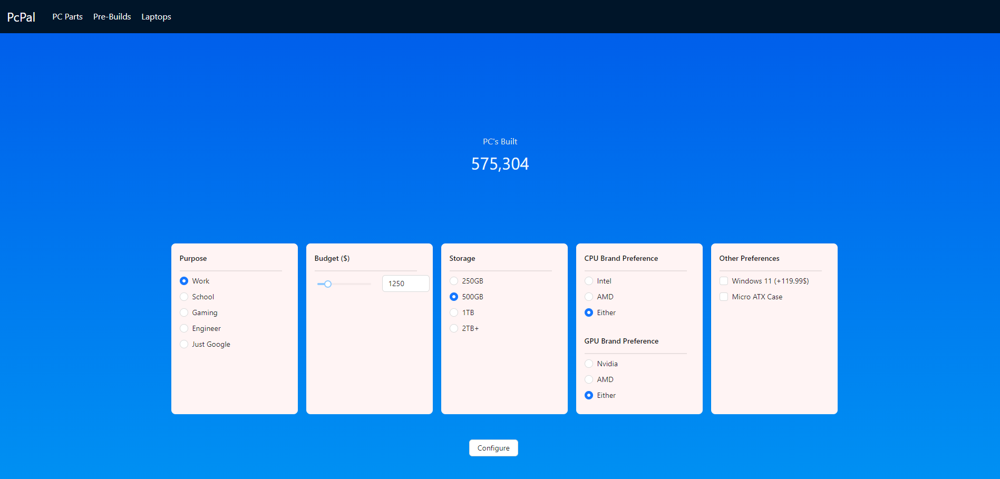

## PcPal
A comprehensive PC configuration tool designed to help users create PC builds based on their needs and budget. PcPal provides recommendations for components, offers budget suggestions, and assists with selecting compatible hardware.

## Table of Contents
- [Description](#description)
- [Features](#features)
- [Installation](#installation)
- [Contributing](#contributing)
- [License](#license)
- [Acknowledgments](#acknowledgments)
- [Contact Information](#contact-information)
- [Images](#images)
- [Notes](#notes)

## Description
PcPal is a PC configuration assistant that guides users through the process of building a custom PC. The app considers user preferences such as budget, use case (e.g., gaming, work, school), and specific component preferences.

With PcPal, you can:

Customize builds according to use cases like gaming, engineering, and more.
Get recommendations for complete pre-built systems.

## Features
Pre-Build Recommendations: Explore complete system builds for different use cases (gaming, work, etc.).
Budget Assistant: Adjust your budget and receive suggestions for parts based on your price range.
Operating System Options: Select your preferred operating system or opt for no OS.

## Installation

## Installation
1. Clone the repository:
   ```bash
   git clone https://github.com/Tugay72/Hotel-Management-System.git
2. Navigate to the project directory:
   ```bash
   cd Hotel-Management-System
3. Install dependencies (if applicable):
   ```bash
   npm install

## Contributing
Fork the repository.
Create a new branch (git checkout -b feature-branch).
Make your changes.
Commit your changes (git commit -m 'Add some feature').
Push to the branch (git push origin feature-branch).
Create a new Pull Request.

## License
This project is licensed under the Creative Commons Attribution-NonCommercial 4.0 International License. See the LICENSE file for details.

## Acknowledgments
Ant Design for UI components.
## Contact Information
Project Link: https://github.com/Tugay72/PcPal

## Images :
 

## Notes
Adjustments: Modify the installation and usage instructions based on the actual setup for your project, especially if you're using specific frameworks or technologies.
Data: Ensure compatibility data is kept up to date with the latest PC parts releases.
Licensing and Acknowledgments: This project uses a Creative Commons NonCommercial License.
